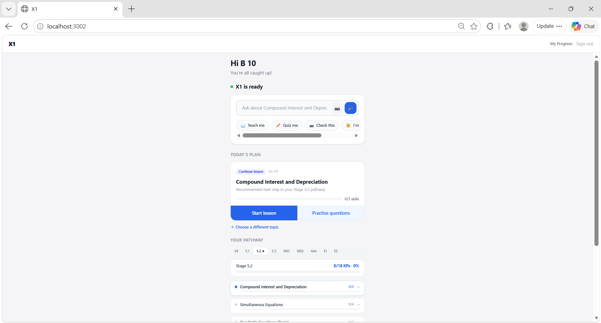
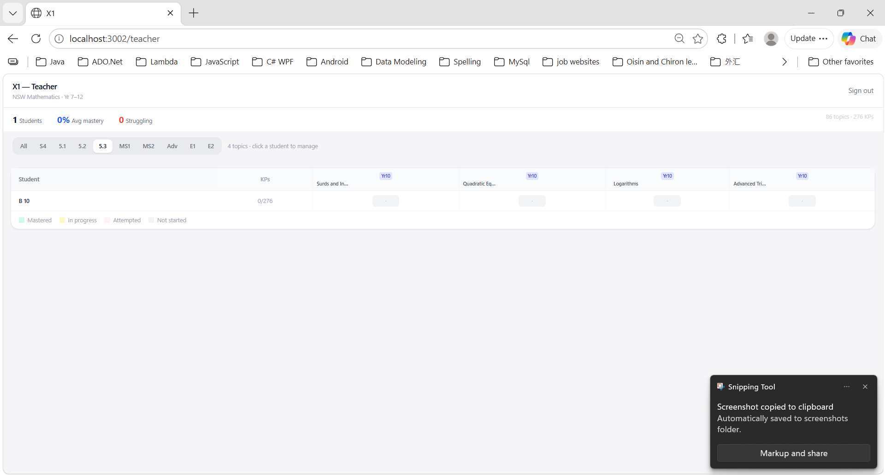
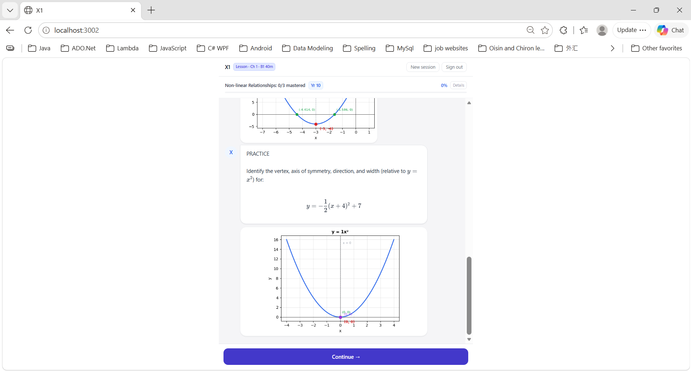
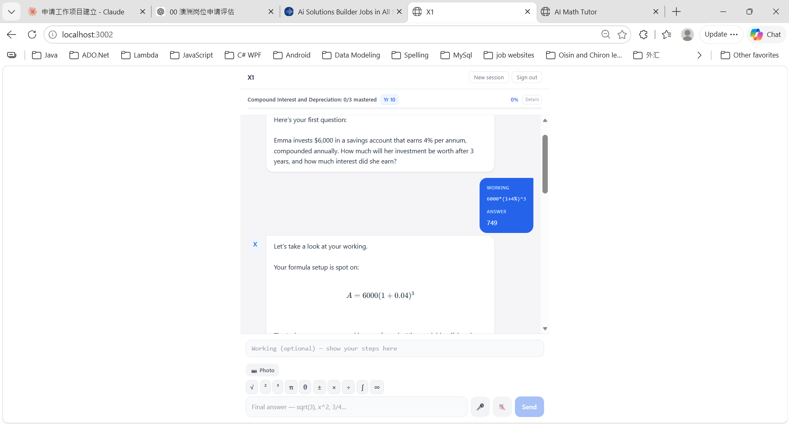
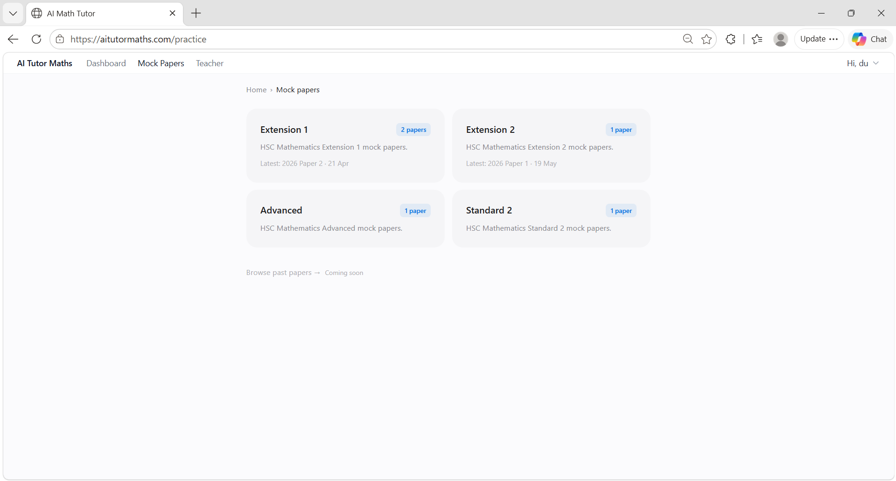
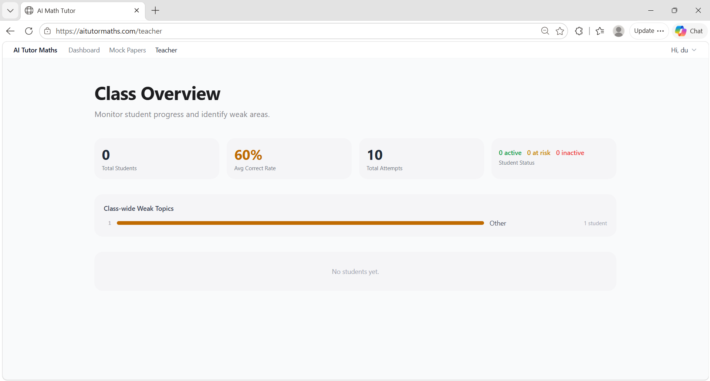
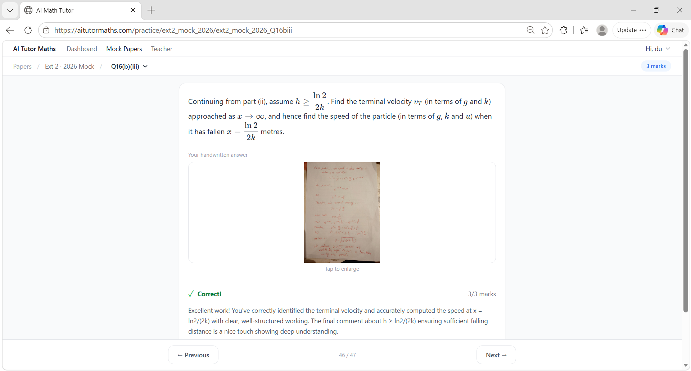

# Lei Du — AI Solutions Portfolio

I design, build and ship AI-powered systems end-to-end on off-the-shelf platforms — solo, from problem framing to production. This repo is the walkthrough; the systems themselves run elsewhere.

Based in Sydney, Australia. [aitutormaths.com](https://aitutormaths.com)  ·  larrydu2002@users.noreply.github.com

---

## Production platforms — built & owned solo

Two AI maths-tutoring platforms. Different problems, shared engineering principles. (Two more systems — a pipeline and an agent — are below.)

| | **X1** | **aitutormaths** |
|---|---|---|
| **For** | NSW students Years 7–12 — 1-on-1 tutor across the full curriculum | HSC students — exam-intelligence + mock-paper practice |
| **Scope** | 85 topics, 273 knowledge points, 8 streams (Stage 4 → Extension 2) | All 4 HSC Maths streams (Standard 2, Advanced, Ext 1, Ext 2) |
| **Status** | Built solo · runs locally · live demo available | **Live in production** at [aitutormaths.com](https://aitutormaths.com) |
| **Stack** | React 18 · FastAPI · SQLite · Claude API · OpenAI (Whisper, TTS, Vision) | React · FastAPI · Claude & GPT · Sydney production server |

---

## Two architectures, on purpose — pipeline *and* agent

The two platforms above are tutoring systems. Alongside them I've built the same kind of system at both ends of a deeper line: a **controlled pipeline** and a **genuine agent**. Knowing which one a problem needs is the actual engineering judgement — so I built both.

**Strata Manager** — a case-management system for a Sydney strata complex. It turns years of scattered email into structured, evidence-backed case files for formal disputes. It's a **controlled multi-stage pipeline** with role-based prompts (classification → summarisation → legal research → letter drafting). The stage order lives in my code *by design* — it's a high-compliance, auditable legal context, where predictability matters more than flexibility. 354 emails → 75 cross-linked cases, with citation tracking and an audit trail.

**[Product-Listing Agent](https://github.com/larrydu2002/product-agent)** — a genuine **agent**, built on the Anthropic SDK as a hand-written tool-use loop (no framework). Given a sparse product and a set of tools, the *model* decides which tool to call, in what order, and when it's done. The control flow belongs to the model, not my code — my loop only executes the tool the model names and hands the result back.

| | **Pipeline** (Strata) | **Agent** (Product-Listing) |
|---|---|---|
| Who controls the flow | My code | The model |
| Predictability | High — same path every time | Lower — path varies by input |
| Auditability | Strong — fixed stages, easy to trace | Needs more instrumentation |
| Best for | Regulated / high-stakes work where the steps must be guaranteed | Open-ended tasks where the right path isn't known in advance |

Neither is "better." A controlled pipeline is a **design choice for predictability and auditability**, not a missing capability. The judgement is knowing *when* to reach for each.

---

## How I work — three principles that show up in both systems

### 1. Define the measurable benefit *before* you build

In X1, the first design decision wasn't a feature — it was cost. I pre-extracted Cambridge textbook questions into a local question bank and inject them into prompts at runtime, instead of generating each question with the model. That alone **cut API calls by roughly 50%**, before anything else shipped.

### 2. Engineer for reliability where the model can't be trusted

LLM output is non-deterministic. In a learning system that's a correctness problem; in a regulated environment it's a compliance problem. I design around it:

- **Structured EVAL blocks** parse model output deterministically for grading — so marks come from rules, not model judgement.
- A **deterministic graph engine** with 17 predefined graph types (bearings, unit circle, Argand plane, probability trees, compound growth, etc.) plus sandboxed matplotlib for custom plots. The model picks *which* graph; it never *draws* one.
- **Multi-stage QA gates** on aitutormaths — AI generation, independent multi-model review (Claude / GPT) and human verification — before any paper goes live.
- JWT auth and production safety checks.

### 3. Stay close to real users, then prune what isn't working

Both platforms went in front of real students early. Features that didn't earn their place came out. Photo-input grading on aitutormaths exists because students kept photographing their workings on paper — not because it was on a roadmap.

---

## Walkthrough — X1

> Adaptive 1-on-1 tutor across NSW Maths Years 7–12. Built solo. Powered by Claude (Opus) for tutoring and OpenAI for multimodal IO.

### Student dashboard — AI-native entry point

Voice / photo / text entry through "Ask X1", with intent chips (Teach me · Quiz me · Check this). Below: today's adaptive recommendation, and the student's curriculum pathway across all 8 streams (S4 → E2) with per-stage progress.

### Teacher view — KP mastery across 85 topics, 273 KPs

Mastery matrix per student across all streams. Built so a tutor can see, at a glance, where a student is mastered / in progress / attempted / not started — and click in to manage.

### Mini-lesson — Teach → Example → Practice → Evaluate

A complete worked example with vertex, axis of symmetry, direction and width — then a deterministic graph the engine plots from the parsed equation, with annotated roots and vertex. The model decided *what to teach*; the graph engine drew the picture.

### Grading — structured EVAL blocks + LaTeX

Student submits WORKING and ANSWER. The model returns a structured EVAL block parsed by rules, not by free-form interpretation; LaTeX renders inline. This is how marks stay defensible.

---

## Walkthrough — aitutormaths.com (live)

> HSC exam-intelligence platform. Mock papers across all 4 NSW Maths streams, with worked solutions, marking criteria and AI-powered photo-marking. Running in production from Sydney.

### Mock papers — all four HSC streams

Standard 2, Advanced, Extension 1, Extension 2 — each card shows the latest paper and date. The exam-intelligence pipeline behind this maps over a decade of official NESA material to syllabus dot points and granular knowledge points, as machine-readable JSON.

### Teacher view — class-wide weak topics

A teacher monitoring view: total students, average correct rate, total attempts, student status, and class-wide weak topics surfaced automatically. The same QA-and-data infrastructure that grades student work powers the cohort view.

### Photo marking — Claude Vision on handwritten work

A real Extension 2 HSC mock question. Student photographs their handwritten solution; Claude Vision reads it, marks it against criteria, and explains *why* — not just whether — the answer is right. 3/3 marks here, with reasoning that names the specific mathematical step that mattered.

---

## Tech, plainly

**Build:** React 18 · Vite · Tailwind · FastAPI (Python) · SQLite (aiosqlite) · REST APIs
**AI / LLM:** Claude API (Opus, Sonnet, Haiku) · OpenAI API (Whisper STT, TTS, GPT) · Claude Vision · prompt & pipeline design · hand-written tool-use agents (Anthropic SDK) · multi-model QA workflows · exploring Claude orchestration via MCP
**Systems:** JWT auth · streaming chat · multi-tab session isolation · sandboxed code execution · production deployment on a Sydney VPS
**Foundations:** Software engineering (C/C++, SQL) from earlier career; 15+ years between business and engineering teams at Oracle, Citrix, IBM.

---

## Why I work this way

I spent 15 years between business teams and engineering at Oracle, Citrix and IBM — mapping how people actually work, getting new technology adopted in places that resisted it, and translating technical limits to non-technical stakeholders. I led the first XenMobile deployment in the Chinese banking sector and the first CloudPlatform order in mainland China, at Ping An Insurance.

What I've been doing for the last year is going back to building with my own hands — but with the same lens: define the benefit, build the smallest thing that delivers it, put it in front of real users, and own it as it evolves.

---

## Live walkthrough

The full walkthrough — including X1 running locally with Opus-powered tutoring — is best seen live. I'm happy to demo in a call or interview.

📧  larrydu2002@users.noreply.github.com  ·  📍 Sydney, NSW
